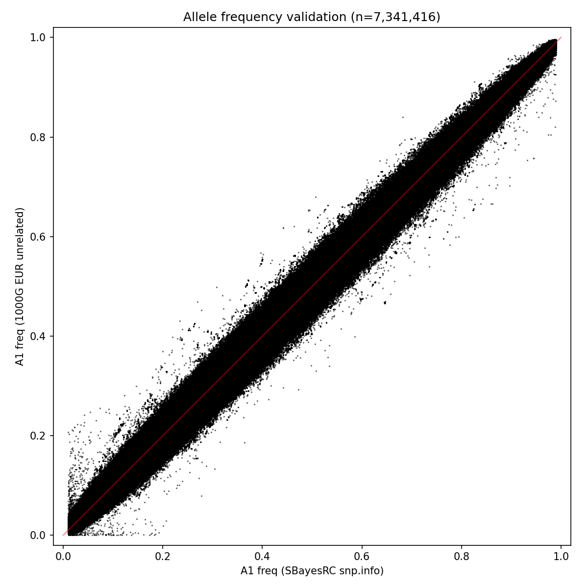
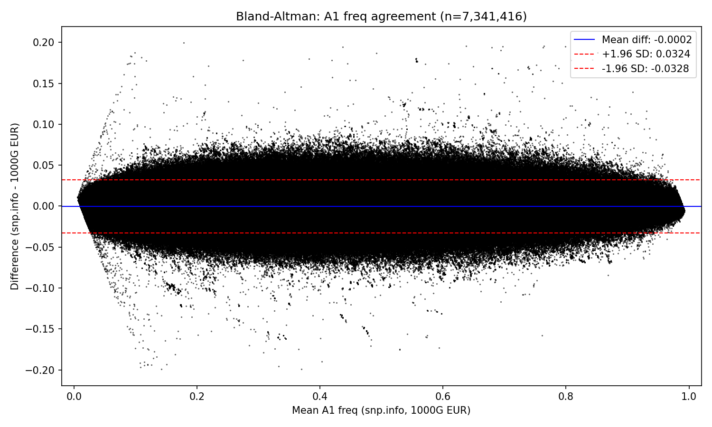

# SBayesRC snp.info hg19 to hg38 Liftover

Reproducible pipeline to lift the [SBayesRC](https://github.com/zhilizheng/SBayesRC) `snp.info` file (7,356,518 SNPs, autosomes 1-22) from GRCh37/hg19 to GRCh38/hg38.

## Quick Start

```bash
# Requirements: Python 3.10+, curl
bash main.sh
```

The script creates a virtual environment, installs dependencies, downloads all reference files on first run, and produces the output. Everything is stored inside the repo directory (`tools/`, `tmp/`). Delete the repo and there is zero trace left on your system.

Pre-built output files are also available as [GitHub Release](https://github.com/jesseICR/sbayesrc-liftover/releases) assets -- no pipeline run required.

### Docker

```bash
# Pull pre-built image
docker pull ghcr.io/jesseicr/sbayesrc-liftover:latest

# Or build locally
docker build -t sbayesrc-liftover .

# Run (mount the repo directory so downloads persist and output is accessible)
docker run --rm -v $(pwd):/data ghcr.io/jesseicr/sbayesrc-liftover:latest
```

The ~8 GB of downloaded reference files are cached in `tools/` and reused on subsequent runs.

## Why This Exists

SBayesRC's `snp.info` file uses hg19 coordinates. To run GWAS with SBayesRC SNPs in hg38 genotype datasets, we need to lift them to hg38. Getting this wrong is silent and dangerous: if a SNP is mapped to the wrong hg38 position, downstream analyses will join it to the wrong variant in the genotype data, producing incorrect effect estimates with no error message.

For every SNP in the final output, we need to be confident that:

- **The rsID genuinely maps to that hg38 chrom + position.** We confirm this by requiring the rsID to exist in dbSNP (the canonical registry of known human variants on GRCh38). If an rsID isn't in dbSNP's current GRCh38 release, the variant may not exist on hg38, may have been merged or retired, or was never mapped to GRCh38 -- so we can't trust that it refers to a real variant at a real position.
- **The position is correct.** We cross-validate UCSC liftOver's coordinate conversion against dbSNP's independently curated position. If they disagree, something is wrong (typically a segmental duplication region), and the SNP is discarded rather than guessing which source is right.
- **The alleles are correct.** We verify the reference allele against the actual hg38 FASTA sequence, and check that the alternate allele is one that dbSNP recognises for that rsID. This catches cases where liftOver maps to a paralogous position that happens to share the same reference base but represents a different variant.
- **The allele frequency is plausible.** We compare against 1000 Genomes EUR allele frequencies as a final sanity check. A large frequency discrepancy (>0.2) suggests a mapping or strand error. We use 1000 Genomes rather than dbSNP for this check because dbSNP's frequencies are aggregated across studies and populations; 1000G provides clean per-population frequencies from a well-defined reference panel, which is a better match for the European-ancestry frequencies in SBayesRC's snp.info.

### The liftOver problem

UCSC liftOver works well for the vast majority of SNPs, but it makes errors in **segmental duplication regions** (NBPF genes on chr1, HLA on chr6, etc.). In these regions, it can map a variant to a paralogous copy at the wrong genomic position. These errors are hard to catch: the allele may coincidentally match the reference at the wrong location, so a naive allele-vs-reference check won't flag it.

### What the pipeline does about it

Every SNP is cross-validated against dbSNP. If UCSC liftOver and dbSNP disagree on where a SNP is, the SNP is discarded -- not overridden. The final output contains only SNPs that passed all checks. Of 7,356,518 input SNPs, 7,354,747 (99.98%) survive.

### Strand flips

Between hg19 and hg38, some genomic regions are represented on the opposite strand. UCSC liftOver detects these from the chain alignment. In the final output of 7,354,747 SNPs, only **12 have strand-flipped alleles** (9 confirmed, 3 rescue). Their A1_hg38/A2_hg38 alleles are complemented (A↔T, C↔G) relative to the original snp.info A1/A2.

## What gets included

Only SNPs with status `confirmed` or `rescue` make it into the final output (`sbayesrc_hg38.csv`). Everything else is excluded. A SNP must pass **all six** of these criteria:

1. **Has a dbSNP entry** -- the rsID exists in dbSNP with an hg38 position on the same chromosome.
2. **Position is confirmed** -- if UCSC liftOver produced a position, it must equal the dbSNP position. If liftOver failed, the dbSNP position alone is accepted ("rescue").
3. **dbSNP ref matches the genome** -- the reference allele that dbSNP reports for this rsID must equal the actual base in the hg38 FASTA at that position.
4. **One allele matches the reference** -- at least one of A1 or A2 (or their strand complement) must equal the hg38 FASTA reference base.
5. **The other allele is in dbSNP's alts** -- the non-reference allele (on the same strand that matched the ref) must appear in dbSNP's ALT field for this rsID.
6. **Allele frequency agreement** -- if the SNP is found in 1000 Genomes EUR, |A1Freq - a1_freq_kg| must be <= 0.2. SNPs not found in 1000G are not penalised.

Any failure on any criterion means the SNP is excluded.

## Pipeline

### Step 1: UCSC liftOver

Converts all 7,356,518 hg19 positions to hg38 using the UCSC liftOver binary and the hg19-to-hg38 chain file.

- Writes a 6-column BED to detect **strand flips** from the chain alignment
- SNPs that liftOver maps to a **different chromosome** are treated as unmapped
- Records `pos_liftover` for each SNP (-1 if liftOver failed)

### Step 2: dbSNP cross-validation

Looks up each SNP's rsID in dbSNP (GRCh38) and compares the result to liftOver. Each SNP gets exactly one status:

| Status | What happened | Included? |
|--------|---------------|:---------:|
| `confirmed` | liftOver and dbSNP both give the same chrom + position | Yes |
| `rescue` | liftOver failed, but dbSNP has a position for this rsID | Yes |
| `conflict` | liftOver and dbSNP give **different** positions | **No** |
| `no_dbsnp` | rsID not found in dbSNP at all | **No** |
| `unmapped` | liftOver failed and rsID not in dbSNP either | **No** |

**Conflicts are the key safety mechanism.** If UCSC and dbSNP disagree, neither is trusted -- the SNP is discarded.

### Step 3: FASTA reference validation

For every `confirmed` and `rescue` SNP, fetches the actual base from the hg38 FASTA at the hg38 position and runs three checks:

**Check 1: Does dbSNP's ref allele match the FASTA?**
The reference allele that dbSNP reports for this rsID should equal the actual genomic base. If not → `fasta_mismatch`, excluded.

**Check 2: Does at least one allele match the FASTA ref?**
One of A1 or A2 (or their strand complement) must equal the FASTA base. If neither does → `allele_mismatch`, excluded.

**Check 3: Is the non-ref allele in dbSNP's ALT field?**
Whichever allele is NOT the reference (on the strand that matched) must appear in dbSNP's ALT. For multi-allelic sites, dbSNP lists multiple alts (e.g., `A,G`) -- the non-ref allele must be one of them. If not → `alt_mismatch`, excluded.

*Note on strand in check 3:* if A1's complement matched the ref (not A1 itself), then we check A2's complement against dbSNP alts -- both alleles are treated on the same strand.

### Step 4: Allele annotation

For all SNPs that passed steps 1-3:

- **Strand-flipped liftOver SNPs:** alleles are complemented (A↔T, C↔G) based on the strand flip detected in step 1
- **Rescue SNPs:** alleles are complemented if needed to match the FASTA reference strand
- **Ref/alt assignment:** records which of A1_hg38 or A2_hg38 is the reference allele

### Duplicate position check

After annotation, the pipeline checks whether any two passed SNPs share the same hg38 chrom + position. If so, both are excluded as `duplicate_pos` -- the mapping is ambiguous.

### Step 5: 1000G EUR allele frequency QC

Compares allele frequencies against 1000 Genomes European unrelated samples. **SNPs with |A1Freq - a1_freq_kg| > 0.2 are excluded** as `kg_freq_diff`. SNPs not found in 1000G are kept (they are not penalised).

The 1000G pvar file contains pre-computed `AF_EUR_unrel` values, so no genotype processing or sample filtering is needed.

**How allele matching works:** Both our output and 1000G are on the hg38 forward strand, so we match by exact identity -- no strand complement logic. The merge uses all five columns (rsID + chrom + pos + ref + alt). This correctly handles multi-allelic sites in 1000G, where the same rsID has multiple rows with different alt alleles: only the row with our specific alt allele matches.

**What `a1_freq_kg` means:** `AF_EUR_unrel` in the pvar is the frequency of the ALT allele. If A1 is the alt → `a1_freq_kg = AF_EUR_unrel`. If A1 is the ref → `a1_freq_kg = 1 - AF_EUR_unrel`.

## Results

*Numbers below are from the most recent pipeline run. Re-run `bash main.sh` to regenerate.*

### Status breakdown

| Status | Count | In final output? |
|--------|------:|:-----------------:|
| `confirmed` | 7,352,534 | Yes |
| `rescue` | 2,213 | Yes |
| `conflict` | 25 | No |
| `no_dbsnp` | 1,538 | No |
| `unmapped` | 2 | No |
| `fasta_mismatch` | 0 | No |
| `allele_mismatch` | 0 | No |
| `alt_mismatch` | 0 | No |
| `duplicate_pos` | 0 | No |
| `kg_freq_diff` | 206 | No |
| **Total input** | **7,356,518** | |
| **Total in sbayesrc_hg38.csv** | **7,354,747** | |

### Notes on excluded SNPs

- **25 conflicts** -- UCSC liftOver and dbSNP disagree on the hg38 position. All are in segmental duplication or HLA regions (chr1 NBPF, chr3, chr6 HLA, chr11).
- **1,538 no_dbsnp** -- rsID not found in the current dbSNP release (0.02% of input). Cannot be independently confirmed.
- **2 unmapped** -- rs117553620 (chr17) and rs140636911 (chr19). Neither liftOver nor dbSNP resolves them.
- **0 fasta/allele/alt mismatches** -- every included SNP's alleles are consistent with the hg38 FASTA and dbSNP.
- **0 duplicate positions** -- no two passed SNPs share the same hg38 chrom + pos.
- **206 kg_freq_diff** -- allele frequency in snp.info differs from 1000G EUR by more than 0.2. Likely mapping errors or population stratification artefacts.

### 1000G allele frequency QC

Of the 7,354,953 SNPs that passed steps 1-4:

- **7,341,622** (99.8%) matched a 1000G entry on rsID + chrom + pos + ref + alt
- **13,206** had an rsID not present in 1000G at all
- **125** had the rsID in 1000G but with a different alt allele (multi-allelic site where 1000G only has a different variant)
- **206** matched SNPs had |A1Freq - a1_freq_kg| > 0.2 and were **excluded**
- **7,341,416** matched SNPs passed the frequency filter

Of the **7,354,747** SNPs in the final output, **7,341,416** (99.8%) have a 1000G EUR allele frequency. The remaining 13,331 are not in 1000G.





Both plots show only the 7,341,416 SNPs that passed the frequency filter. SNPs not found in 1000G are not plotted.

## Logging

Every pipeline run writes a timestamped log file to `logs/` (e.g., `logs/run_20260408_161500.log`). The log captures all console output including per-step SNP counts and the final summary. The `logs/` directory is gitignored.

## Input

The canonical SBayesRC `snp.info` file (tab-delimited):

| Column | Description |
|--------|-------------|
| Chrom | Chromosome (1-22) |
| ID | rsID |
| Index | SBayesRC internal index |
| GenPos | Genetic position |
| PhysPos | Physical position (hg19) |
| A1 | Effect allele |
| A2 | Other allele |
| A1Freq | Effect allele frequency |
| N | Sample size |
| Block | LD block |

## Output

Three output files are produced:

### `sbayesrc_hg38.csv` (primary output)

One row per SNP that passed all inclusion criteria:

| Column | Description |
|--------|-------------|
| chrom | Chromosome |
| pos | hg38 position |
| ref | Reference allele (matches hg38 FASTA) |
| alt | Alternate allele (matches a dbSNP alt) |
| rsid | rsID |

### `sbayesrc_liftover_results.csv` (verbose results)

One row per input SNP (7,356,518 rows), including excluded SNPs:

| Column | Description |
|--------|-------------|
| chrom | Chromosome |
| ID | rsID |
| pos_hg19 | Original hg19 position |
| pos_hg38 | Final hg38 position (-1 if excluded) |
| pos_liftover | Position from UCSC liftOver (-1 if liftOver failed) |
| pos_dbsnp | Position from dbSNP (-1 if rsID not in dbSNP) |
| A1, A2 | Original alleles from snp.info |
| A1_hg38, A2_hg38 | Alleles on hg38 strand (complemented if strand-flipped) |
| dbsnp_ref | Reference allele from dbSNP (empty if no dbSNP entry) |
| dbsnp_alt | Alternate allele(s) from dbSNP (comma-separated if multi-allelic; empty if no entry) |
| fasta_ref | Actual hg38 FASTA base at pos_hg38 (empty if excluded before this check) |
| ref_match | Which allele matches the hg38 ref: `A1_hg38` or `A2_hg38` (empty if excluded) |
| strand_flip | Whether alleles were complemented (`True`/`False`) |
| status | One of: `confirmed`, `rescue`, `conflict`, `no_dbsnp`, `unmapped`, `fasta_mismatch`, `allele_mismatch`, `alt_mismatch`, `duplicate_pos`, `kg_freq_diff` |
| a1_freq_kg | Frequency of A1 in 1000G EUR unrelated (`NaN` if not matched in 1000G) |
| Index, GenPos, A1Freq, N, Block | Preserved from snp.info |

### `kg_validation/allele_freq_validation.png` and `bland_altman.png`

Scatter plot and Bland-Altman plot of SBayesRC A1 frequency vs 1000G EUR A1 frequency. Only SNPs that passed the frequency filter are plotted.

## Runtime and Storage

**Benchmarked on:** 128 cores, 503 GiB RAM (AMD Threadripper PRO 5995WX)

### Per-Step Runtime

| Step | Description | Runtime |
|------|-------------|---------|
| 0 | Setup (download tools, FASTA, chain file, 1000G pvar) | ~30 min first run, <1 s cached |
| 0b | Build dbSNP lookup from VCF (first run only) | ~15-30 min |
| 0c | Build 1000G EUR lookup from pvar (first run only) | ~2 min |
| 1 | UCSC liftOver (7.36M SNPs) | ~40 s |
| 2 | dbSNP cross-validation | ~10 s |
| 3 | FASTA reference validation | ~10 s |
| 4 | Allele annotation + duplicate check | ~10 s |
| 5 | 1000G EUR frequency validation + scatter plot | ~30 s |
| -- | Write output CSVs | ~20 s |

**Total pipeline runtime: ~130 seconds** (cached run, all reference files present).

First-run download time depends on network speed. The dbSNP VCF (~28 GB), hg38 FASTA (~900 MB), and 1000G pvar (~2.7 GB) are the largest downloads. The dbSNP VCF is streamed and decompressed on the fly -- only the extracted lookup TSV (~193 MB) is saved to disk.

### Storage

| Directory / File | Size | Contents |
|------------------|-----:|---------|
| `tools/hg38.fa` | 3.1 GB | GRCh38 reference FASTA (UCSC, decompressed) |
| `tools/hg38.fa.gz` | 939 MB | Compressed FASTA (kept for re-extraction) |
| `tools/kg_all.pvar.zst` | 2.7 GB | 1000 Genomes pvar (zstd-compressed, contains AF_EUR_unrel) |
| `tools/kg_eur_lookup.tsv` | ~200 MB | rsID-to-EUR-AF table (extracted from pvar) |
| `tools/dbsnp_lookup.tsv` | 193 MB | rsID-to-position table (extracted from 28 GB dbSNP VCF) |
| `tools/venv/` | ~150 MB | Python virtual environment |
| `tools/bin/liftOver` | 24 MB | UCSC liftOver binary |
| `tools/hg19ToHg38.over.chain.gz` | 224 KB | hg19-to-hg38 chain file |
| `tmp/` | ~250 MB | Intermediate BED files |
| **Total** | **~8 GB** | |

## Directory Structure

```
.
├── main.sh                     Entry point (venv setup + logging + pipeline)
├── liftover.py                 Pipeline logic (single file)
├── requirements.txt            Python dependencies (pandas, pysam, zstandard, matplotlib)
├── snp.info                    Input: SBayesRC SNPs, hg19 (auto-downloaded)
├── Dockerfile
├── .dockerignore
├── .gitignore
├── .github/
│   └── workflows/
│       └── docker-publish.yml  Builds and publishes Docker image to GHCR
├── README.md
├── logs/                       Timestamped run logs (gitignored)
├── kg_validation/              1000G validation output (git-tracked)
│   ├── allele_freq_validation.png
│   └── bland_altman.png
├── tools/                      Downloaded reference files (gitignored)
│   ├── bin/liftOver
│   ├── venv/
│   ├── hg19ToHg38.over.chain.gz
│   ├── hg38.fa, hg38.fa.fai
│   ├── dbsnp_lookup.tsv
│   ├── kg_all.pvar.zst
│   └── kg_eur_lookup.tsv
└── tmp/                        Intermediate BED files (gitignored)
```

## Requirements

- Python 3.10+ (a virtual environment is created automatically)
- `curl` (for downloading dbSNP VCF and 1000G pvar)

## Known Limitations

- **~1,540 SNPs have no dbSNP entry** (0.02% of 7.36M). These are excluded because they cannot be independently confirmed.
- **Strand-ambiguous SNPs (A/T, C/G):** Strand flips are detected from the chain alignment, not from the alleles themselves. For A/T and C/G SNPs, complementing swaps the labels but not the nucleotide identity. This is correct but may look surprising in the output.
- **dbSNP version:** The pipeline streams from NCBI's `latest_release` URL, so the dbSNP version changes when NCBI publishes updates. The cached `dbsnp_lookup.tsv` is not automatically refreshed -- delete it to re-stream.
- **1000G frequency filter** -- SNPs with |A1Freq - a1_freq_kg| > 0.2 are excluded. SNPs not found in 1000G at all are kept. The 0.2 threshold is conservative; large differences typically indicate mapping or strand errors rather than genuine population effects.

## Data Sources

- **UCSC liftOver binary:** https://hgdownload.soe.ucsc.edu/admin/exe/
- **hg19-to-hg38 chain file:** https://hgdownload.soe.ucsc.edu/goldenPath/hg19/liftOver/
- **GRCh38 reference FASTA:** https://hgdownload.soe.ucsc.edu/goldenPath/hg38/bigZips/
- **dbSNP VCF (GRCh38):** https://ftp.ncbi.nlm.nih.gov/snp/latest_release/VCF/
- **1000 Genomes pvar (hg38):** Dropbox-hosted pfiles with pre-computed per-population allele frequencies
- **SBayesRC:** https://github.com/zhilizheng/SBayesRC
